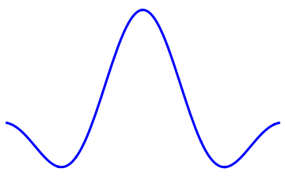

## Fellowships für Innovationen in der digitalen Hochschullehre“ (digiFellow) 
# Digitaler Aufgabenpool Mathematik  

## Team
- Fakultät 04: Prof. Dr. Jan-Philipp Schmidt
- Fakultät 07: Prof. Dr. Heiko Knospe, Wiss. Mitarbeiter*innen Patricia Graf, Katharina Hammersen und Andreas Schwenk
- Fakultät 09: Prof. Dr. Angela Schmitz, Wiss. Mitarbeiter*innen Silvia Becher, Dr. Susanne Hilger und Jan Reißner

## Overview
Ilias & Moodle STACK Aufgaben -->

Taxonomie und QS -->

Export (XML) von Ilias & Moodle nach GitHub -->

Such-, Filter und Previewfunktionen -->

Import (XML) von GitHub nach Ilias & Moodle 

<!--
**aufgabenpool/aufgabenpool** is a ✨ _special_ ✨ repository because its `README.md` (this file) appears on your GitHub profile.

Here are some ideas to get you started:

- 🔭 I’m currently working on ...
- 🌱 I’m currently learning ...
- 👯 I’m looking to collaborate on ...
- 🤔 I’m looking for help with ...
- 💬 Ask me about ...
- 📫 How to reach me: ...
- 😄 Pronouns: ...
- ⚡ Fun fact: ...
-->
