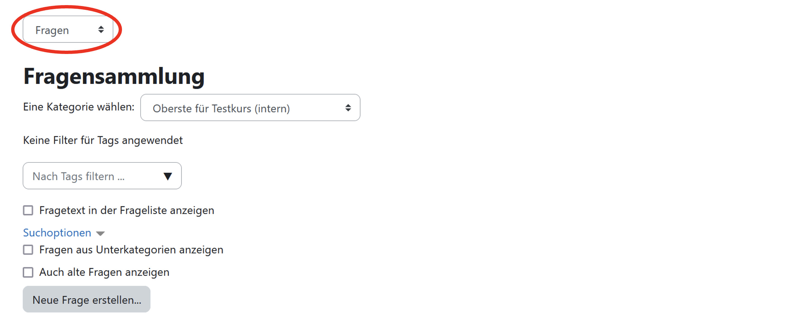

# Anleitung zum Upload neuer Aufgaben

Wir freuen uns über neue Aufgaben! Nehmen Sie bitte zunächst mit uns Kontakt auf, um im E-Learning-System _Moodle_ Zugriff zu erhalten (Kontaktdaten stehen und auf dieser Seite).

Im Wesentlichen umfasst der Prozess die folgenden drei Schritte:

1. Upload der Aufgaben in Moodle
2. Tagging der Aufgaben (= Kategorisierung)
3. Qualitätssicherung + Freischaltung

Die folgenden Abschnitte beschreiben die einzelnen Schritte im Detail.

## 1. Upload der Aufgaben in Moodle

Loggen Sie sich in [Moodle](https://aufgabenpool.th-koeln.de/moodle/) ein und wählen Sie Ihren _Kurs_ für den Upload aus. Sie finden dort eine (zunächst leere) "Fragensammlung". Wählen Sie diese aus.

In der Upload-Maske angekommen (siehe Abbildung 1), kann man mit einem Klick auf "Fragen" (siehe roter Kreis in der Abbildung) und der darauffolgenden Auswahl von "Import" zur Import-Maske gelangen (siehe Abbildung 2).

_Hinweis: Aufgaben sollten nach Themengebieten hochgeladen werden, sodass man diese nicht im Nachhinein noch sortieren muss._

&nbsp;&nbsp;&nbsp;&nbsp;&nbsp; _Abbildung 1: Upload-Maske (Fragensammlung)_

&nbsp;&nbsp;&nbsp;&nbsp;&nbsp; _Abbildung 2: Import-Maske_

1. In der Import-Maske wird zunächst das Dateiformat der hochzuladenden Aufgaben angegeben. Hier z.B. "Moodle-XML-Format" (siehe Abbildung 2). Das Fragezeichen hinter den Dateiformaten zeigt mehr Informationen zum jeweiligen Dateiformat an.

2. Als Nächstes wird unter "Allgemeines" die Importkategorie ausgewählt. Diese sind nach Themengebieten erstellt, weshalb ein Upload von mehreren Aufgaben gleichzeitig nur aus einem übergeordneten Themengebiet stammen sollten. Wie man eine Aufgabe nach einer falschen Zuordnung im Nachhinein noch verschiebt wird im späteren Verlauf erläutert.

3. Nun können Aufgaben im zuvor gewählten Dateiformat (hier Moodle-XML-Format) hochgeladen werden. Dies kann per Drag-and-drop oder durch einen Klick auf "Datei wählen" geschehen.
   In einem grün hinterlegten Feld wird einem die erfolgreich importierte Anzahl an Aufgaben ("Fragen") angezeigt. Bei Fehlern wird eine rot hinterlegte Fehlermeldung dargestellt. Mit einem Klick auf "Weiter" wird man zur Kategorie weitergeleitet, in die man die Aufgabe(n) importiert hat. Hier kann man importierte Aufgaben bearbeiten und auch wieder löschen.

## 2. Aufgaben Taggen

Für die inhaltliche Einordnung legt man für jede hochgeladene Aufgabe eine Menge von Tags fest (z.B. zu Inhaltsgebieten, Taxonomien nach Bloom und Maier).

Das Taggen der Aufgaben wird an anderer Stelle fortgeführt:
LINK
In der Tagging-Oberfläche angekommen navigiert man zunächst unter "Kategorien" zur gewünschten Kategorie, in die man neue Aufgaben hochgeladen hat (in unserem Beispiel "Differentialrechnung").
Scrollt man nun runter werden alle Aufgaben der gewählten Kategorie aneinandergereiht. Jede Aufgabe lässt sich nun mit der folgenden Maske taggen (siehe Abbildung 3).

&nbsp;&nbsp;&nbsp;&nbsp;&nbsp; _Abbildung 3: Tagging-Maske (Beispiel: Quotientenregel aus Differentialrechnung mit gesetzten Tags)_

1. Unter den Kategorien und über allen Aufgaben der Kategorie, wird die aktuell ausgewählte Kategorie angezeigt, wie viele Aufgaben diese enthält und bei wie vielen Aufgaben davon noch Handlungsbedarf bezüglich zu setzender Tags besteht, damit sie den Status "OK" erlangen (siehe Abbildung 3, unten).

2. Hier wird der Titel der Aufgabe und ein Beispielbild der Aufgabe angezeigt. Unterhalb des Aufgabentitels befindet sich ein "Moodle-Link" (siehe Abbildung 3). Mit diesem Link kann man direkt zur Bearbeitung dieser Frage in die Fragensammlung gelangen. Anhand des Beispielbilds können die nun folgenden Tags gesetzt werden.

3. Themengebiets-Tags dienen einer Zuordnung bis hin zu einer dritten Ebenen ("TE3"). Auf dritter Ebene können sogar bis zu vier (a bis d) Themengebiet-Tags verteilt werden. Von Ebene zu Ebene (1 bis 3 und nicht a bis d) wird genauer spezifiziert, um was für einen Typ Aufgabe es sich thematisch handelt. Diese Themengebiet-Tags sind bereits vorgegeben.

4. Der Herkunfts-Tag identifiziert den Uploader bzw. dessen Institution. Hier zum Beispiel "F07-INT" (Fakultät 07 für Informations-, Medien- und Elektrotechnik - Institut für Nachrichtentechnik). Herkunftstags werden administrativ neu angelegt.

5. Taxonomie-Tags nach Bloom und Maier dienen der systematischen Einordnung der Aufgaben. Eine genauere Erklärung der verschiedenen Tags finden Sie im Anhang.

6. [Der folgende Punkt ist nur durch die TH Köln durchführbar:] An dieser Stelle kann festgestellt werden, inwiefern die Aufgabe qualitätsgeprüft ist. Dabei unterscheidet man visuell (falsche Formatierung, falscher Absatz usw.), sprachlich (Rechtschreib- und Grammatikfehler, sonstige Fehler im Schriftbild in Aufgabe, Hinweistexten oder Lösungswegen usw.), inhaltlich (inhaltliche Fehler in der Aufgabenstellung oder Lösung usw.), Tagging (sind die Tags oberhalb von 6. richtig gesetzt), Import Ilias (lässt sich die Aufgabe ohne Fehler nach Ilias importieren) und Import Moodle (lässt sich die Aufgabe ohne Fehler nach Moodle importieren).

7. Gibt es Fehler innerhalb der Aufgabe, befindet sich die Aufgabe noch in Bearbeitung oder soll diese noch nicht öffentlich im Aufgabenpool sichtbar werden, dann kann die "Aufgabe gesperrt" werden und taucht somit nicht im öffentlichen und finalen Aufgabenpool auf. Außerdem kann man mit dem Tag "Aufgabe praxiserprobt" festhalten, dass eine Aufgabe bereits an einem z.B. studentischem Publikum zur Anwendung gekommen ist.
   Sind alle Tags gesetzt, muss man diese mit einem Klick auf "Änderungen speichern" sichern. Diesen Vorgang wiederholt man für alle Aufgaben.

## 3. Qualitätssicherung

Ihre Aufgaben sind nach dem Taggen noch nicht direkt im Aufgabenpool sichtbar. TODO.

# Anhang (Taxonomie-Tags)

## Bloom

`[bloom:*]`

-   **Wissen** _(Faktenwissen, Kennen)_ &nbsp; `[bloom:1]`

    Die Lernenden geben wieder, was sie vorher gelernt haben. Der Prüfungsstoff musste auswendig gelernt oder geübt werden.

-   **Verständnis** _(Verstehen, mit eigenen Worten begründen)_ &nbsp; `[bloom:2]`

    Die Lernenden erklären z.B. einen Begriff, eine Formel, einen Sachverhalt oder ein Gerät. Ihr Verständnis zeigt sich darin, dass sie das Gelernte auch in einem Kontext präsent haben, der sich vom Kontext unterscheidet, in dem gelernt worden ist. So können die Lernenden z.B. einen Sachverhalt auch umgangssprachlich erläutern oder den Zusammenhang graphisch darstellen.

-   **Anwendung** _(Umsetzung eindimensionaler Lerninhalte, Beispiele aus eigener Praxis)_ &nbsp; `[bloom:3]`

    Die Lernenden wenden etwas Gelerntes in einer neuen Situation an. Diese Anwendungssituation ist bisher nicht vorgekommen.

-   **Analyse** _(Zerlegen in Einzelteile, Fallstudien)_ &nbsp; `[bloom:4]`

    Die Lernenden zerlegen Modelle, Verfahren oder anderes in deren Bestandteile. Dabei müssen sie in komplexen Sachverhalten die Aufbauprinzipien oder inneren Strukturen entdecken. Sie erkennen Zusammenhänge.

-   **Synthese** _(Vernetzen und optimieren, fachübergreifend darstellen, Projektaufgaben)_ &nbsp; `[bloom:5]`

    Die Lernenden zeigen eine konstruktive Leistung. Sie müssen verschiedene Teile zusammenfügen, die sie noch nicht zusammen erlebt oder gesehen haben. Aus ihrer Sicht müssen sie eine schöpferische Leistung erbringen. Das Neue ist aber in der bisherigen Erfahrung oder in der Kenntnis der Lernenden noch nicht vorhanden.

-   **Beurteilung** _(Entspricht bloom:5 (Synthese) mit zusätzlicher Bewertung durch die Lernenden)_ &nbsp; `[bloom:6]`

    Die Lernenden beurteilen ein Modell, eine Lösung, einen Ansatz, ein Verfahren oder etwas Ähnliches insgesamt in Hinsicht auf dessen Zweckmäßigkeit oder innere Struktur. Sie kennen z.B. das Modell, dessen Bestandteile und darüber hinaus noch die Qualitätsangemessenheit, die innere Stimmigkeit oder Funktionstüchtigkeit. Darüber müssen sie sich ein Urteil bilden, um die Aufgabe richtig zu lösen.

## Maier

**Art des Wissens** &nbsp; `[maier:1:*]`

-   **Faktenwissen** &nbsp; `[maier:1:1]`

    explizit verbalisierbar, in Aussagenform gespeichert, Kenntnis isolierter, aber auch komplexer Fakten, terminologisches Wissen, Regeln abfragen ohne Anwendung

-   **Prozedurales Wissen** &nbsp; `[maier:1:2]`

    implizit und nicht verbalisierbar, Automatisierte Verhaltensweisen, Routinen, Algorithmen, Fertigkeiten bis zu komplexen Routinen und Handlungsmustern

-   **Konzeptuelles Wissen** &nbsp; `[maier:1:3]`

    verbalisierbar und/oder implizit, Klassifikationen, Schemata, Kategorien, Begriffsnetze, Modellierungen, Erklärungen, vielfach vernetzt zu Zusammenhängen und Begriffsnetzen

-   **Metakognitives Wissen** &nbsp; `[maier:1:4]`

    Wissen über eigenes Wissen, Steuerung von Lernhandlungen, (Monitoring), Wissen über Informationsverarbeitungsstrategien, wird direkt in der Aufgabenstellung angeregt oder gefordert

**Kognitive Prozesse** &nbsp; `[maier:2:*]`

-   **Reproduktion** &nbsp; `[maier:2:1]`

    Abruf von Wissen aus dem Langzeitgedächtnis, Wiedergabe von gespeicherten Wissen, Nachahmung von Prozeduren, auch metakogn. und konzept. Wissen kann reproduziert werden

-   **Naher Transfer** &nbsp; `[maier:2:2]`

    Aufgabensituation und gespeichertes Wissen unterscheiden sich nur geringfügig; eindeutig, welches Wissen (Fakten, Konzepte, etc.) zur Anwendung kommt, einfache Verfahren anwenden, kleinschrittiges Ausführen

-   **Weiter Transfer** &nbsp; `[maier:2:3]`

    Anwendungssituation/Aufgabe ist relativ neu, nicht sofort einsichtig, welches Wissen zur Anwendung kommt; Wissen ist allerdings in der Form vorhanden, in der es zur Anwendung kommt; Einige Anhaltspunkte sind vorgegeben, ohne jedoch auf einen Lösungsweg festzulegen

-   **Kreatives Problemlösen** &nbsp; `[maier:2:4]`

    unbekannte Aufgabensituation; unklar, welches Wissen zur Anwendung kommt; das zur Bearbeitung einer Situation erforderliche Wissen muss erst zusammengefügt werden; Schüler müssen auf unterschiedliche Wissensarten zurückgreifen (Fakten, Konzepte, Prozeduren, Strategiewissen); Problemlöseprozess: Problem finden bzw. definieren, Lösungen entwerfen, Lösungen umsetzen und Lösungen bewerten.

**Anzahl der Wissenseinheiten** &nbsp; `[maier:3:*]`

Wissenseinheiten: Die für eine Aufgabe zu aktivierenden, fachspezifischen Wissenselemente aus der Perspektive eines "Experten"; jeweils hierarchisch höchste Ebene betrachten (z.B. keine Subprozeduren aufzählen)

-   **Aufgaben mit einer Wissenseinheit** &nbsp; `[maier:3:1]`
    Nur ein Begriff, Konzept oder eine Prozedur auf höchster Ebene zu aktivieren.

-   **Aufgaben mit bis zu vier Wissenseinheiten** &nbsp; `[maier:3:2]`
    2 bis 4 Begriffe; Konzepte oder Prozeduren müssen auf oberster Hierarchieebene gleichzeitig aktiviert und verknüpft werden

-   **Aufgaben mit mehr als vier Wissenseinheiten** &nbsp; `[maier:3:3]`
    Eine große Zahl (mehr als 4) verschiedener Begriffe, Konzepte oder Prozeduren muss gleichzeitig aktiviert werden

**Offenheit der Aufgabenstellung** &nbsp; `[maier:4:*]`

-   **Definierte und konvergente Aufgaben** &nbsp; `[maier:4:1]`

    Die Aufgabe umfasst einen eindeutigen Arbeitsauftrag bzw. eine klar identifizierbare Fragestellung; Eine Lösung ist gesucht bzw. richtig; dies muss allerdings nicht explizit angegeben sein

-   **Definierte und divergente Aufgaben** &nbsp; `[maier:4:2]`

    eindeutiger Arbeitsauftrag; bei dem mehrere Lösungen möglich sind. Die Aufgabe umfasst eine klar identifizierbare Fragestellung; mehrere Lösungen (bzw. Lösungswege) sind gesucht bzw. richtig; in der Regel werden die Schüler auf diesen Umstand hingewiesen

-   **Schlecht definierte und divergente Aufgaben** &nbsp; `[maier:4:3]`

    Die Schüler erhalten Informationen über ein Problem, eine Situation, etc. Es sind unterschiedliche Fragestellungen denkbar; eine Problemsituation ist die einzige Handlungsaufforderung; damit sind auch mehrere Lösungen (bzw. Lösungswege) gesucht bzw. richtig

**Lebensweltbezug** &nbsp; `[maier:5:*]`

-   **Aufgaben ohne Lebensweltbezug** &nbsp; `[maier:5:1]`

    Keine Verknüpfung zwischen Fachwissen und Lebenswelt/Erfahrungsbereich der Schüler/innen gefordert oder vorgegeben

-   **Aufgaben mit konstruiertem Lebensweltbezug** &nbsp; `[maier:5:2]`

    Verknüpfung zwischen Fachwissen und Lebenswelt stark konstruiert; entspricht eher nicht den Erfahrungen des Schülers; Analogien zur eigenen Erfahrung kaum erkennbar; Bezug wirkt "aufgesetzt"; Fachwissen soll eingekleidet werden

-   **Aufgaben mit konstruiertem, aber authentisch wirkendem Lebensweltbezug** &nbsp; `[maier:5:3]`

    Lebensweltbezug ist konstruiert, macht im Zusammenhang der Aufgabe aber Sinn; entspricht größtenteils den Erfahrungen der Schüler; wirkt nicht aufgesetzt; sinnvolle Anwendungen für Alltag, Berufsleben, etc.

-   **Aufgaben mit realem Lebensweltbezug** &nbsp; `[maier:5:4]`

    Keine Differenz zwischen Aufgabe und Lebenswelt; reale Problemstellung ist zu bearbeiten

**Sprachlogische Komplexität** &nbsp; `[maier:6:*]`

-   **Aufgaben mit einfacher sprachlogischer Komplexität** &nbsp; `[maier:6:1]`

    wenig Text; chronologisch geordnet; einfache Syntax; kein oder kaum Text. Reihenfolge der Sätze entspricht Aufgabenbearbeitung; einfache Haupt- und Nebensätze

-   **Aufgaben mit mittlerer sprachlogischer Komplexität** &nbsp; `[maier:6:2]`

    Textpassagen mit teilweise für die Aufgabenbearbeitung irrelevanten Informationen; sprachlich komplexer. Reihenfolge der Sätze entspricht nicht immer der Aufgabenbearbeitung; Textpassagen mit irrelevanter Information

-   **Aufgaben mit hoher sprachlogischer Komplexität** &nbsp; `[maier:6:3]`

    z.T. irrelevante, irritierende Formulierungen; komplexe Syntax. Aufgabe verdeckt die inneren, logischen Bezüge; logische Funktionen (Verneinungen, wenn-dann Verknüpfungen, Allaussagen, etc.); komplexe Satzgefüge

**Repräsentationsformen des Wissens** &nbsp; `[maier:7:*]`

-   **Aufgaben mit einer Repräsentationsform** &nbsp; `[maier:7:1]`

    Aufgabenstellung und Aufgabenlösung basieren auf einer Repräsentationsform. Aufgabeninformation und Aufgabenlösung basieren auf Wissen in einer Repräsentationsform; eventuell noch andere Repräsentationsformen vorhanden, die für die Lösung jedoch irrelevant sind (z.B. Bild zur Illustration)

-   **Integration verschiedener Repräsentationsformen** &nbsp; `[maier:7:2]`

    Aufgabe gibt Wissen in verschiedenen Repräsentationsformen vor; Integration dieser Formen für die Lösung nötig; Aufgabenlösung bewegt sich innerhalb der vorgegebenen Repräsentationsformen

-   **Integration und Transformation des Wissens** &nbsp; `[maier:7:3]`

    Schüler muss für die Aufgabenlösung das vorliegende Wissen in eine Repräsentationsform transformieren, die nicht durch die Aufgabe vorgegeben wird
