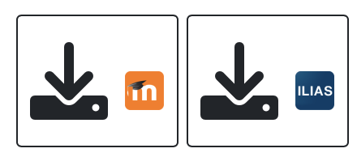

## Anleitung zur Nutzung des Aufgabenpools

- eine Aufzähung
- nächster Punkt

Hier [ein Link](https://www-cs-faculty.stanford.edu/~knuth/).

Eine Abbildung

## Weitere Überschrift

Informationen über Markdown z.B. [hier](https://www.markdownguide.org/cheat-sheet/)

[Link zum Aufgabenpool](https://aufgabenpool.th-koeln.de/pool.php) (ggf. anmelden)
