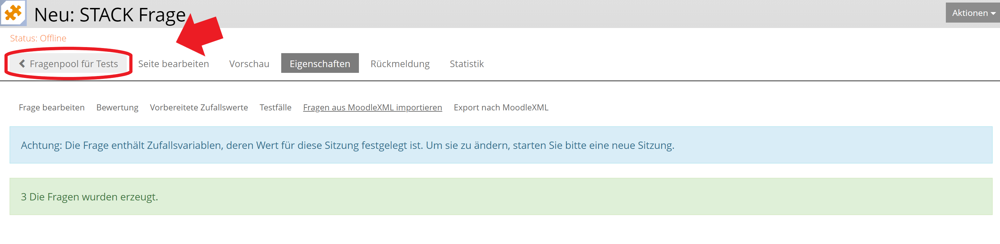

# Anleitung zur Nutzung des Aufgabenpools

Der Aufgabenpool bietet eine große Auswahl an verschiedenen Aufgaben, die nach Themengebieten und Taxonomien selektierbar sind.

Dies ist eine Schritt für Schritt Anleitung, wie Sie Aufgaben aus dem Aufgabenpool in Moodle oder Ilias verwenden können. Im ersten Teil wird erklärt, wie man sich eine Datei mit Aufgaben - ein sogenanntes "Aufgabenblatt" - herunterlädt. Im zweiten Teil wird gezeigt, wie die Aufgaben in Ilias (2.a) oder in Moodle (2.b) importiert werden können.

## 1. Aufgabenblatt erstellen

- Den Aufgabenpool finden Sie [hier](https://aufgabenpool.th-koeln.de/pool.php) (ggf. anmelden)

- Hier kann nun ein Aufgabenblatt zusammengestellt werden, um eine moodle-xml Datei zu erzeugen, welche in Moodle oder Ilias importiert werden kann

- Das Aufgabenblatt finden Sie hier

- Dieses ist zu Beginn leer. Nun können Aufgaben hinzugefügt werden

- Falls Sie auf den Button "Aufgabenblatt" geklickt haben, müssen Sie jetzt wieder zurück zur Fragensammlung. Dazu einmal auf "Fragensammlung" klicken

- Hier können Sie nun ein oder mehrere Themengebiete auswählen, indem Sie auf die entsprechenden Buttons klicken.

- Die Auswahl ist auch weiter verfeinerbar: Es gibt drei Themengebietsebenen und weitere Auswahlmöglichkeiten. Um näheres zu erfahren, einfach mit dem Mauszeiger über die Buttons fahren.

- Nach der Auswahl der Themengebiete erscheinen die zugehörigen Aufgaben unterhalb der Auswahlbereichs

- Aufgaben können nun einzeln zum Aufgabenblatt hinzugefügt werden durch klicken auf den entsprechenden Button unterhalb der Aufgabe

- ACHTUNG: Manche Aufgaben sind nicht für den Import in Ilias geeignet. Das erkennen Sie an dem Symbol in der unteren rechten Ecke der Aufgabe

- Ist die Auswahl der Aufgaben beendet, kehren Sie wieder zum Seitenanfang zurück und klicken auf "Aufgabenblatt"

- Die Aufgaben können nun als moodle.xml Datei heruntergeladen werden durch klicken auf den entsprechenden Button (orange für den Import in Moodle, blau für Ilias)

- Befinden sich ausversehen Aufgaben auf dem Aufgabenblatt, die nicht für den Ilias-Import geeignet sind, während man eine Datei für den Import nach Ilias erstellt (durch klicken auf den blauen Ilias-Button), werden in der Regel nur die Aufgaben heruntergeladen, die auch für den Import nach Ilias geeignet sind. Fehler beim Import in Ilias können aber in diesem Fall nicht ausgeschlossen werden

## 2.a Import in Ilias

- Anmelden bei Ilias

- Gehen Sie in den entsprechenden Kurs, in dem Sie die Aufgaben hochladen wollen

- Nun kann ein Fragenpool für Tests erstellt werden

- Dazu klicken Sie auf "Neues Objekt hinzufügen" und anschließend auf "Fragenpool für Tests"

- Wählen Sie einen Titel und klicken anschließend auf "Frragenpool anlegen"

- Anschließend klicken Sie auf "Frage erstellen", wählen dann beim Fragetyp "STACK Frage" aus und klicken danach auf "Erstellen"

- Nun klicken Sie auf "Frage aus MoodleXML importieren"

- Wählen Sie die gewünschte Datei aus (falls nicht anders eingestellt, befindet sie sich im Download Ordner und heißt my-worksheet.xml) und klicken anschließend auf "Importieren"

- Sie haben die Fragen erfolgreich importiert!

- Durch klicken auf "Fragenpool für Tests" lässt sich nun auf die Aufgaben zugreifen

## 2.b Import in Moodle

- Anmelden bei Moodle

- Gehen Sie in den entsprechenden Kurs, in dem Sie die Aufgaben hochladen wollen

- Wählen Sie eine Kategorie aus oder erstellen Sie ggf. eine neue Kategorie durch klicken auf "Kategorie hinzufügen"

- Nun klicken Sie auf "Import", wählen anschließend als Dateiformat "Moodle-XML-Format" und klicken dann auf "Datei wählen ..."

- Wählen Sie die gewünschte Datei aus (falls nicht anders eingestellt, befindet sie sich im Download Ordner und heißt my-worksheet.xml) und klicken anschließend auf "Datei hochladen"

- Dann klicken Sie unten auf "Import"

- Nun sollten Sie eine Vorschau der Fragen sehen. Scrollen Sie nach unten und klicken auf "Weiter"

- Sie haben die Fragen erfolgreich importiert!

