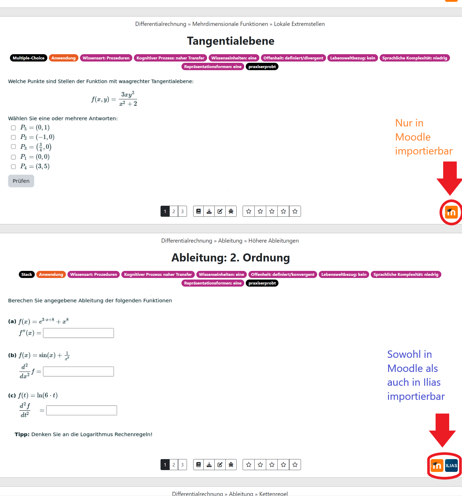

## Anleitung zur Nutzung des Aufgabenpools

- Große Auswahl an Aufgaben zu verschiedenen Themen
- Gezielte Zusammenstellung von Aufgaben zu einem Aufgabenblatt möglich
- Import nach Moodle oder Ilias

Hier [ein Link](https://www-cs-faculty.stanford.edu/~knuth/).

Eine Abbildung

## Weitere Überschrift

Informationen über Markdown z.B. [hier](https://www.markdownguide.org/cheat-sheet/)

## Aufgabenblatt erstellen

-Den Aufgabenpool finden Sie [hier](https://aufgabenpool.th-koeln.de/pool.php) (ggf. anmelden)

-Hier kann nun ein Aufgabenblatt zusammengestellt werden, um eine moodle-xml Datei zu erstellen, welche in Moodle oder Ilias importiert werden kann

-Das Aufgabenblatt finden Sie hier

-Dieses ist zu Beginn leer. Nun können Aufgaben hinzugefügt werden

-Falls Sie auf den Button "Aufgabenblatt" geklickt haben, müssen Sie jetzt wieder zurück zur Fragensammlung. Dazu einmal auf "Fragensammlung" klicken

-Themengebiet auswählen

-Die Aufgaben zu dem ausgewählten Themengebiet finden Sie unten

-Aufgaben können nun einzeln zum Aufgabenblatt hinzugefügt werden

-ACHTUNG: Manche Aufgaben können nicht in Ilias importiert werden. Das erkennen Sie an dem Symbol in der unteren rechten Ecke der Aufgabe

-Ist die Auswahl beendet, kehren Sie wieder zum Seitenanfang zurück und klicken auf "Aufgabenblatt"
