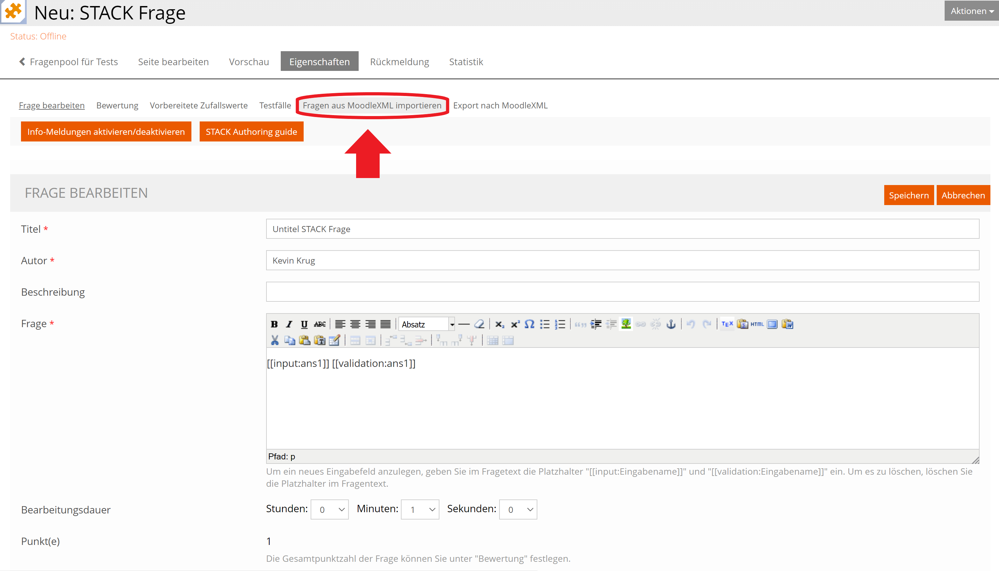
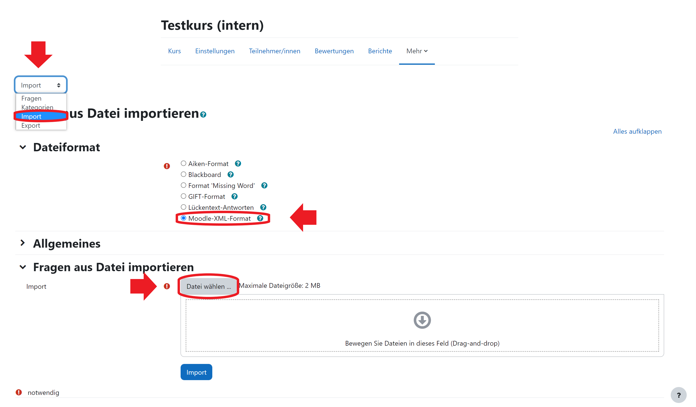

## Anleitung zur Nutzung des Aufgabenpools

- Große Auswahl an Aufgaben zu verschiedenen Themen
- Gezielte Zusammenstellung von Aufgaben zu einem Aufgabenblatt möglich
- Import nach Moodle oder Ilias

Hier [ein Link](https://www-cs-faculty.stanford.edu/~knuth/).

Eine Abbildung

## Weitere Überschrift

Informationen über Markdown z.B. [hier](https://www.markdownguide.org/cheat-sheet/)

## Aufgabenblatt erstellen

-Den Aufgabenpool finden Sie [hier](https://aufgabenpool.th-koeln.de/pool.php) (ggf. anmelden)

-Hier kann nun ein Aufgabenblatt zusammengestellt werden, um eine moodle-xml Datei zu erstellen, welche in Moodle oder Ilias importiert werden kann

-Das Aufgabenblatt finden Sie hier

-Dieses ist zu Beginn leer. Nun können Aufgaben hinzugefügt werden

-Falls Sie auf den Button "Aufgabenblatt" geklickt haben, müssen Sie jetzt wieder zurück zur Fragensammlung. Dazu einmal auf "Fragensammlung" klicken

-Themengebiet auswählen

-Die Aufgaben zu dem ausgewählten Themengebiet finden Sie unten

-Aufgaben können nun einzeln zum Aufgabenblatt hinzugefügt werden

-ACHTUNG: Manche Aufgaben können nicht in Ilias importiert werden. Das erkennen Sie an dem Symbol in der unteren rechten Ecke der Aufgabe

-Ist die Auswahl beendet, kehren Sie wieder zum Seitenanfang zurück und klicken auf "Aufgabenblatt"

-Die Aufgaben können nun als moodle.xml Datei heruntergeladen werden durch klicken auf den entsprechenden Button (orange für den Import in Moodle, blau für Ilias)

## Import in Ilias

-Anmelden bei Ilias

-Gehen Sie in den entsprechenden Kurs, in dem Sie die Aufgaben hochladen wollen

-Nun kann ein Fragenpool für Tests erstellt werden

-Dazu klicken Sie auf "Neues Objekt hinzufügen" und anschließend auf "Fragenpool für Tests"

-Wählen Sie einen Titel und klicken anschließend auf "Frage erstellen"

-Wählen Sie beim Fragetyp "STACK Frage" aus und klicken dann auf "Erstellen"

-Nun klicken Sie auf "Frage aus MoodleXML importieren"

-Wählen Sie die gewünschte Datei aus (falls nicht anders eingestellt, befindet sie sich im Download Ordner und heißt my-worksheet.xml) und klicken anschließend auf "Importieren"

-Sie haben die Fragen erfolgreich importiert!

-Durch klicken auf "Fragenpool für Tests" lässt sich nun auf die Aufgaben zugreifen

## Import in Moodle

-Anmelden bei Moodle

-Gehen Sie in den entsprechenden Kurs, in dem Sie die Aufgaben hochladen wollen

-Wählen Sie eine Kategorie aus oder erstellen Sie ggf. eine neue Kategorie

-Nun klicken Sie auf "Import", wählen anschließend als Dateiformat "Moodle-XML-Format" und klicken dann auf "Datei wählen ..."

-Wählen Sie die gewünschte Datei aus (falls nicht anders eingestellt, befindet sie sich im Download Ordner und heißt my-worksheet.xml) und klicken anschließend auf "Datei hochladen"

-Dann klicken Sie unten auf "Import"

-Nun sollten Sie eine Vorschau der Fragen sehen. Scrollen Sie nach unten und klicken auf "Weiter"

-Sie haben die Fragen erfolgreich importiert!

